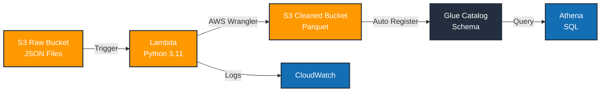

# YouTube Analytics ETL Pipeline on AWS

A serverless ETL pipeline that transforms raw YouTube category JSON data into optimized Parquet datasets for analytics. Built with AWS Lambda, S3, Glue, and Athena.

## Architecture



## How It Works

1. Raw JSON files uploaded to S3 trigger Lambda via S3 events
2. Lambda reads JSON using AWS Wrangler and pandas
3. Data flattened with `json_normalize()` to remove nested structure
4. Cleaned data written as Parquet to S3 (80-90% compression vs JSON)
5. Glue Catalog automatically registers schema for metadata tracking
6. Athena queries cleaned data with SQL

## Technology Stack

| Component | Technology | Purpose |
|-----------|-----------|---------|
| Compute | AWS Lambda | Event-driven processing |
| Storage | Amazon S3 | Raw data + cleaned data lake |
| Processing | Python 3.11, Pandas, AWS Wrangler | Data transformation |
| Metadata | AWS Glue | Schema registry and catalog |
| Analytics | Amazon Athena | SQL queries on Parquet |
| Monitoring | CloudWatch | Function logs and metrics |

## Project Structure

```
youtube-data-engineering-aws/
├── lambda/
│   ├── lambda_function.py          # ETL handler
│   └── requirements.txt            # awswrangler, pandas, boto3
├── raw_data/                       # Sample reference data
│   ├── US_category_id.json
│   ├── GB_category_id.json
│   └── ... (10 regions total)
├── README.md
├── requirements.txt
└── .gitignore
```

## Deployment

### Prerequisites
```bash
aws --version              # AWS CLI v2+
python3 --version         # Python 3.9+
aws sts get-caller-identity  # Verify AWS access
```

### 1. Create S3 Buckets
```bash
aws s3 mb s3://youtube-raw-data-prod
aws s3 mb s3://youtube-cleaned-data-prod
```

### 2. Create IAM Role
```bash
cat > trust-policy.json << EOF
{
  "Version": "2012-10-17",
  "Statement": [{
    "Effect": "Allow",
    "Principal": {"Service": "lambda.amazonaws.com"},
    "Action": "sts:AssumeRole"
  }]
}
EOF

aws iam create-role \
  --role-name youtube-etl-lambda-role \
  --assume-role-policy-document file://trust-policy.json
```

### 3. Attach IAM Policy
```bash
cat > s3-glue-policy.json << EOF
{
  "Version": "2012-10-17",
  "Statement": [
    {"Effect": "Allow", "Action": ["s3:GetObject", "s3:ListBucket"], "Resource": ["arn:aws:s3:::youtube-raw-data-prod*"]},
    {"Effect": "Allow", "Action": ["s3:PutObject"], "Resource": ["arn:aws:s3:::youtube-cleaned-data-prod/*"]},
    {"Effect": "Allow", "Action": ["glue:*"], "Resource": "*"},
    {"Effect": "Allow", "Action": ["logs:CreateLogGroup", "logs:CreateLogStream", "logs:PutLogEvents"], "Resource": "arn:aws:logs:*:*:*"}
  ]
}
EOF

aws iam put-role-policy --role-name youtube-etl-lambda-role --policy-name youtube-etl-policy --policy-document file://s3-glue-policy.json
```

### 4. Create Glue Database
```bash
aws glue create-database --database-input Name=youtube_analytics
```

### 5. Package and Deploy Lambda
```bash
mkdir lambda-pkg && cd lambda-pkg
pip install awswrangler pandas boto3 -t .
cp ../lambda/lambda_function.py .
zip -r lambda_function.zip .
cd ..

aws lambda create-function \
  --function-name youtube-category-etl \
  --runtime python3.11 \
  --role arn:aws:iam::123456789012:role/youtube-etl-lambda-role \
  --handler lambda_function.lambda_handler \
  --zip-file fileb://lambda-pkg/lambda_function.zip \
  --timeout 300 --memory-size 1024

aws lambda update-function-configuration \
  --function-name youtube-category-etl \
  --environment Variables="{s3_cleansed_layer=s3://youtube-cleaned-data-prod/youtube/cleaned_stats/,glue_catalog_db_name=youtube_analytics,glue_catalog_table_name=cleaned_statistics_reference_data,write_data_operation=append}"
```

### 6. Configure S3 Trigger
```bash
aws lambda add-permission \
  --function-name youtube-category-etl \
  --statement-id AllowS3Invoke \
  --action lambda:InvokeFunction \
  --principal s3.amazonaws.com \
  --source-arn arn:aws:s3:::youtube-raw-data-prod

aws s3api put-bucket-notification-configuration \
  --bucket youtube-raw-data-prod \
  --notification-configuration '{
    "LambdaFunctionConfigurations": [{
      "LambdaFunctionArn": "arn:aws:lambda:us-east-1:123456789012:function:youtube-category-etl",
      "Events": ["s3:ObjectCreated:*"]
    }]
  }'
```

## Testing the Pipeline

```bash
# Upload test data
aws s3 cp raw_data/US_category_id.json s3://youtube-raw-data-prod/youtube/

# Verify Glue table was created
aws glue get-table --database-name youtube_analytics --name cleaned_statistics_reference_data

# Check Lambda logs
aws logs tail /aws/lambda/youtube-category-etl --follow
```

## Sample Athena Queries

```sql
-- Count categories by title
SELECT snippet_title, COUNT(*) as count
FROM cleaned_statistics_reference_data
GROUP BY snippet_title
ORDER BY count DESC;

-- Data quality check
SELECT COUNT(*) as total, COUNT(DISTINCT id) as unique_ids
FROM cleaned_statistics_reference_data;
```

## What This Project Demonstrates

- **ETL Design**: Event-driven serverless pipeline with multi-stage processing
- **Data Formats**: JSON ingestion, Parquet storage (80-90% compression)
- **AWS Services**: Lambda, S3, Glue, Athena, CloudWatch, IAM
- **Python Skills**: Pandas, AWS Wrangler, JSON normalization
- **Data Lake Architecture**: Raw zone → Cleaned zone → Analytics queries
- **Cloud Engineering**: Serverless, auto-scaling, cost optimization (~$1-5/month)

## Design Decisions

- **Serverless Lambda**: No infrastructure management, auto-scales, pay-per-use
- **Parquet Format**: Columnar storage reduces query costs 80% vs scanning JSON
- **AWS Wrangler**: Handles S3/Glue integration with minimal code
- **Auto Schema Registration**: Glue discovers schema from first Parquet write
- **Environment Variables**: No hardcoded credentials in function code

## Future Improvements

- Data quality validation (Great Expectations)
- Partitioned datasets (by date/region)
- CI/CD pipeline (GitHub Actions)
- Infrastructure as Code (Terraform)
- Incremental processing with checkpoints

## References

- [AWS Lambda Documentation](https://docs.aws.amazon.com/lambda/)
- [AWS Glue User Guide](https://docs.aws.amazon.com/glue/)
- [Amazon Athena Documentation](https://docs.aws.amazon.com/athena/)
- [AWS SDK for Pandas](https://aws-sdk-pandas.readthedocs.io/)
- [Boto3 Documentation](https://boto3.amazonaws.com/v1/documentation/api/latest/index.html)
