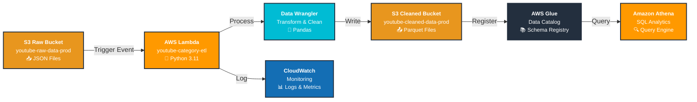
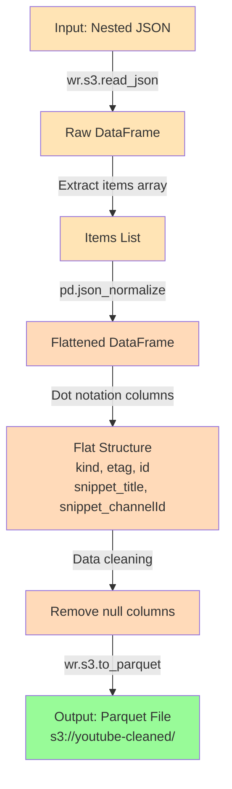
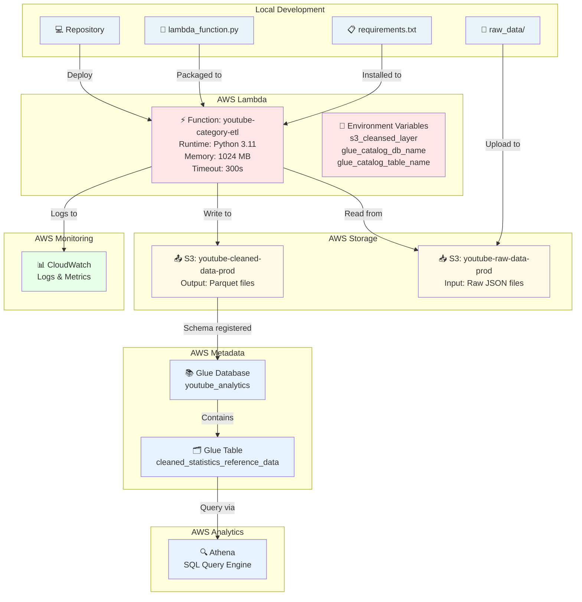

# Serverless YouTube Data Engineering Pipeline on AWS

<div align="center">


**Event-driven ETL pipeline transforming raw YouTube JSON into analytics-optimized Parquet datasets using AWS serverless services.**

</div>

---

## 📋 Overview

A production-grade serverless ETL solution that:
- Automatically processes YouTube category reference data uploaded to S3
- Transforms nested JSON into flat, queryable Parquet format
- Registers metadata in AWS Glue Data Catalog
- Enables SQL analytics via Amazon Athena
- Scales without infrastructure management

**Workflow:** S3 (Raw) → Lambda (Transform) → S3 (Parquet) → Glue Catalog → Athena (Query)

---

## 🏗️ Architecture Diagram



### Data Transformation Flow



---

## 📊 Data Flow Pipeline

| Stage | Component | Input | Output | Key Operation |
|-------|-----------|-------|--------|----------------|
| 1️⃣ **Ingestion** | S3 Bucket | Raw JSON files | — | File upload trigger |
| 2️⃣ **Event** | S3 Events | ObjectCreated | Lambda invoke | Automatic trigger |
| 3️⃣ **Read** | AWS Wrangler | S3 path | DataFrame | `wr.s3.read_json()` |
| 4️⃣ **Extract** | Pandas | Raw DataFrame | Items array | `df["items"]` |
| 5️⃣ **Normalize** | Pandas | Nested JSON | Flat DataFrame | `json_normalize()` |
| 6️⃣ **Clean** | Pandas | All columns | Clean columns | Drop null columns |
| 7️⃣ **Write** | AWS Wrangler | DataFrame | S3 Parquet | `to_parquet()` + Glue |
| 8️⃣ **Catalog** | AWS Glue | Parquet file | Table metadata | Auto schema registration |
| 9️⃣ **Query** | Amazon Athena | Glue table | SQL results | ANSI SQL queries |

---

## 🛠️ Technology Stack

| Component | Technology | Purpose |
|-----------|-----------|---------|
| Compute | AWS Lambda | Serverless event-driven processing |
| Storage | Amazon S3 | Data lake (raw & cleaned layers) |
| Processing | Python + Pandas | Data transformation logic |
| AWS SDK | AWS Wrangler | Optimized S3/Glue integration |
| Metadata | AWS Glue | Schema management & catalog |
| Analytics | Amazon Athena | SQL queries on Parquet |
| Monitoring | CloudWatch | Logging & metrics |
| Security | AWS IAM | Access control & permissions |

---

## 📁 Project Structure & Deployment

### Local Repository Structure
```
youtube-data-engineering-aws/
├── lambda/
│   ├── lambda_function.py          # ⚡ Main ETL handler
│   └── requirements.txt            # Dependencies: awswrangler, pandas, boto3
├── raw_data/                       # 📁 Sample reference data (10 regions)
│   ├── US_category_id.json
│   ├── GB_category_id.json
│   └── ... (CA, DE, FR, IN, JP, KR, MX, RU)
├── README.md                       # 📖 Project documentation
├── requirements.txt                # Root dependencies
└── .gitignore                      # 🔐 Credential protection
```

### AWS Infrastructure Deployment Map



### Lambda Function Execution Flow

```
Input Event
    ↓
[Lambda Handler]
    ├─ Extract S3 bucket & key
    ├─ URL decode key
    └─ Log event details
    ↓
[Data Reading]
    ├─ AWS Wrangler read_json()
    ├─ Load DataFrame
    └─ Validate structure
    ↓
[Data Transformation]
    ├─ json_normalize() flattening
    ├─ Flatten nested columns
    └─ Clean null columns
    ↓
[Data Loading]
    ├─ AWS Wrangler to_parquet()
    ├─ Write to S3 Cleaned
    └─ Register in Glue Catalog
    ↓
[Response]
    ├─ Status: 200 OK
    ├─ Records processed
    └─ Output path
    ↓
[CloudWatch Logs]
    └─ All events logged
```

---

## 🚀 Quick Setup

### Prerequisites
```bash
aws --version           # AWS CLI v2+
python3 --version      # Python 3.9+
aws sts get-caller-identity  # Verify AWS access
```

### Step 1: Create S3 Buckets
```bash
aws s3 mb s3://youtube-raw-data-prod
aws s3 mb s3://youtube-cleaned-data-prod
```

### Step 2: Create IAM Role
```bash
cat > trust-policy.json << 'EOF'
{
  "Version": "2012-10-17",
  "Statement": [{
    "Effect": "Allow",
    "Principal": {"Service": "lambda.amazonaws.com"},
    "Action": "sts:AssumeRole"
  }]
}
EOF

aws iam create-role \
  --role-name youtube-etl-lambda-role \
  --assume-role-policy-document file://trust-policy.json
```

### Step 3: Attach Permissions
```bash
cat > s3-glue-policy.json << 'EOF'
{
  "Version": "2012-10-17",
  "Statement": [
    {
      "Effect": "Allow",
      "Action": ["s3:GetObject", "s3:ListBucket"],
      "Resource": ["arn:aws:s3:::youtube-raw-data-prod*"]
    },
    {
      "Effect": "Allow",
      "Action": ["s3:PutObject"],
      "Resource": ["arn:aws:s3:::youtube-cleaned-data-prod/*"]
    },
    {
      "Effect": "Allow",
      "Action": [
        "glue:CreateTable", "glue:UpdateTable", "glue:GetDatabase",
        "glue:CreateDatabase", "glue:GetTable"
      ],
      "Resource": "*"
    },
    {
      "Effect": "Allow",
      "Action": ["logs:CreateLogGroup", "logs:CreateLogStream", "logs:PutLogEvents"],
      "Resource": "arn:aws:logs:*:*:*"
    }
  ]
}
EOF

aws iam put-role-policy \
  --role-name youtube-etl-lambda-role \
  --policy-name youtube-etl-policy \
  --policy-document file://s3-glue-policy.json
```

### Step 4: Create Glue Database
```bash
aws glue create-database \
  --database-input Name=youtube_analytics,Description="YouTube analytics"
```

### Step 5: Package & Deploy Lambda
```bash
mkdir lambda-pkg && cd lambda-pkg
pip install awswrangler pandas boto3 -t .
cp ../lambda/lambda_function.py .
zip -r lambda_function.zip .
cd ..

aws lambda create-function \
  --function-name youtube-category-etl \
  --runtime python3.11 \
  --role arn:aws:iam::123456789012:role/youtube-etl-lambda-role \
  --handler lambda_function.lambda_handler \
  --zip-file fileb://lambda-pkg/lambda_function.zip \
  --timeout 300 \
  --memory-size 1024
```

### Step 6: Set Environment Variables
```bash
aws lambda update-function-configuration \
  --function-name youtube-category-etl \
  --environment Variables="{
    s3_cleansed_layer=s3://youtube-cleaned-data-prod/youtube/cleaned_stats/,
    glue_catalog_db_name=youtube_analytics,
    glue_catalog_table_name=cleaned_statistics_reference_data,
    write_data_operation=append
  }"
```

### Step 7: Configure S3 Trigger
```bash
aws lambda add-permission \
  --function-name youtube-category-etl \
  --statement-id AllowS3Invoke \
  --action lambda:InvokeFunction \
  --principal s3.amazonaws.com \
  --source-arn arn:aws:s3:::youtube-raw-data-prod

aws s3api put-bucket-notification-configuration \
  --bucket youtube-raw-data-prod \
  --notification-configuration '{
    "LambdaFunctionConfigurations": [{
      "LambdaFunctionArn": "arn:aws:lambda:us-east-1:123456789012:function:youtube-category-etl",
      "Events": ["s3:ObjectCreated:*"],
      "Filter": {
        "Key": {
          "FilterRules": [
            {"Name": "prefix", "Value": "youtube/raw_statistics_reference_data/"},
            {"Name": "suffix", "Value": ".json"}
          ]
        }
      }
    }]
  }'
```

### Step 8: Test Pipeline
```bash
# Upload test file
aws s3 cp raw_data/US_category_id.json \
  s3://youtube-raw-data-prod/youtube/raw_statistics_reference_data/

# Verify Glue table
aws glue get-table --database-name youtube_analytics \
  --name cleaned_statistics_reference_data

# View logs
aws logs tail /aws/lambda/youtube-category-etl --follow
```

---

## 💻 AWS CLI Commands

**S3:**
```bash
aws s3 ls s3://youtube-raw-data-prod/ --recursive
aws s3 cp raw_data/ s3://youtube-raw-data-prod/youtube/ --recursive
```

**Lambda:**
```bash
aws lambda list-functions --query 'Functions[*].[FunctionName,Runtime]' --output table
aws logs tail /aws/lambda/youtube-category-etl --follow
```

**Glue:**
```bash
aws glue get-databases
aws glue get-tables --database-name youtube_analytics
```

---

## 📊 Sample Athena Queries

**Count by Category:**
```sql
SELECT snippet_title, COUNT(*) as count
FROM cleaned_statistics_reference_data
GROUP BY snippet_title
ORDER BY count DESC;
```

**By Region:**
```sql
SELECT country, COUNT(*) as category_count
FROM cleaned_statistics_reference_data
GROUP BY country;
```

**Data Quality:**
```sql
SELECT COUNT(*) as total, COUNT(DISTINCT id) as unique_ids
FROM cleaned_statistics_reference_data;
```

---

## ⚡ Performance & Cost

| Factor | Benefit |
|--------|---------|
| **Parquet vs JSON** | 80-90% smaller, 20x faster queries |
| **Serverless** | Auto-scales, pay-per-use (~$1-5/month) |
| **Columnar Storage** | 80% reduction in Athena query costs |
| **Lambda 1024 MB** | Optimal cost/performance ratio |

---

## 🔐 Security

✅ **IAM least privilege** - Role scoped to specific buckets  
✅ **S3 encryption** - AES256 enabled  
✅ **HTTPS-only** - Enforced access  
✅ **No hardcoded credentials** - Environment variables  
✅ **CloudTrail auditing** - Track all operations  

**Never commit:**
```
AWS_ACCESS_KEY_ID
AWS_SECRET_ACCESS_KEY
*.pem, *.key
.aws/
credentials
```

---

## 📊 Monitoring

**View Logs:**
```bash
aws logs tail /aws/lambda/youtube-category-etl --follow
```

**CloudWatch Alarm:**
```bash
aws cloudwatch put-metric-alarm \
  --alarm-name youtube-lambda-errors \
  --metric-name Errors \
  --namespace AWS/Lambda \
  --threshold 1
```

---

## 🚀 Future Improvements

- Data quality validation (Great Expectations)
- Partitioned datasets (by region/date)
- CI/CD pipeline (GitHub Actions)
- Infrastructure as Code (Terraform)
- Incremental processing
- Data lineage tracking

---

## 🎓 What This Project Demonstrates

**Data Engineering:** ETL pipeline design, serverless architecture, event-driven processing  
**Cloud Architecture:** AWS services integration, scalability, cost optimization  
**Data Skills:** Python, Pandas, SQL, JSON/Parquet formats  
**AWS Proficiency:** S3, Lambda, Glue, Athena, IAM, CloudWatch  
**Best Practices:** Security, monitoring, error handling, performance tuning  

### Interview Talking Points

- **Serverless Choice:** Eliminates ops overhead, auto-scales, cost-efficient
- **Parquet Format:** 80-90% compression, columnar storage, 20x query speed
- **Error Handling:** CloudWatch logs, DLQ for failed messages
- **Scalability:** Lambda auto-scales, S3 unlimited throughput
- **Cost:** ~$1-5/month for typical workloads

---

## 📚 References

- [AWS Lambda](https://docs.aws.amazon.com/lambda/)
- [Amazon S3](https://docs.aws.amazon.com/s3/)
- [AWS Glue](https://docs.aws.amazon.com/glue/)
- [Amazon Athena](https://docs.aws.amazon.com/athena/)
- [AWS SDK for Pandas](https://aws-sdk-pandas.readthedocs.io/)
- [Boto3](https://boto3.amazonaws.com/v1/documentation/api/latest/index.html)

---

<div align="center">

**Status:** ✅ Production Ready | **Last Updated:** January 2024

</div>
